# Activity Graph

A GitHub contribution graph SVG generated daily by a GitHub Action.

## How it works

1. A **Rust script** fetches your GitHub contribution data via the GraphQL API
2. It generates an **SVG file** using `<foreignObject>` with embedded HTML/CSS
3. A **GitHub Action** runs daily (cron job) to regenerate the graph
4. The SVG is displayed in this README

## Screenshot



## GitHub Action

The workflow runs daily at 00:00 UTC and can also be triggered manually.

See [`.github/workflows/generate-graph.yml`](.github/workflows/generate-graph.yml)

## Local Development

```bash
# Build the project
cargo build --release

# Run with test data (no API token needed)
cargo run --release -- --test

# Run with real GitHub data
GITHUB_TOKEN=your_token cargo run --release -- your_username
```

## License

MIT
